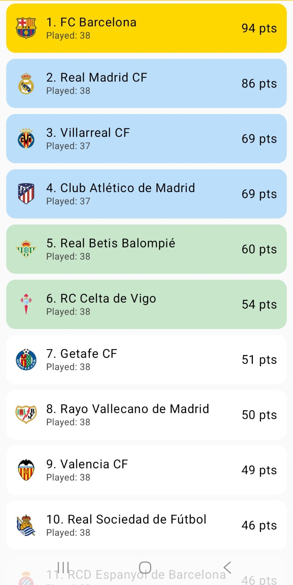
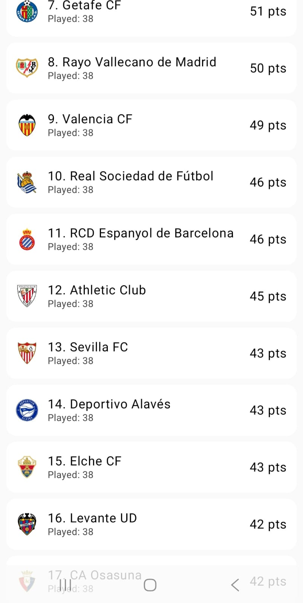
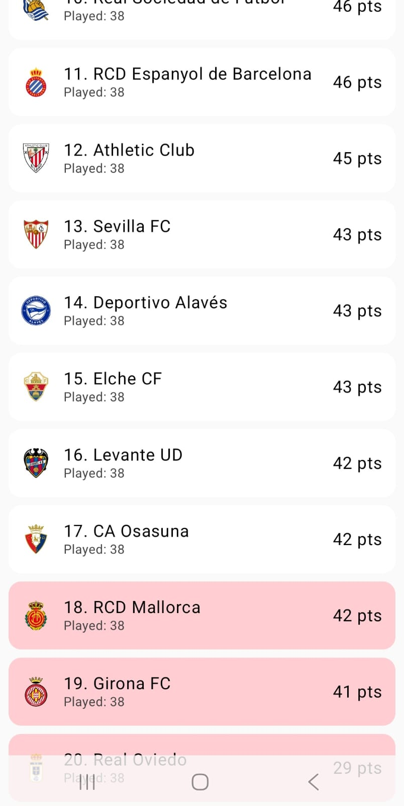

# ⚽ LaLiga Android

A modern Android football standings application built using Java and XML, focused on delivering an engaging La Liga experience with clean UI/UX and smooth navigation.

The app displays La Liga team standings with categorized qualification zones, modern card-based layouts, and responsive Android design.

---

# 🚀 Features

- ⚽ Complete La Liga standings
- 🏆 Champions League qualification highlighting
- 🌍 Europa League qualification section
- 📉 Relegation zone indication
- 🎨 Modern card-based UI design
- 📱 Smooth scrolling experience
- ⚡ RecyclerView implementation
- 🧩 Responsive Android layouts

---

# 🛠️ Tech Stack

| Technology | Usage |
|------------|-------|
| Java | Core Android Development |
| XML | UI Design |
| Android Studio | Development Environment |
| RecyclerView | Dynamic Lists |
| CardView | Modern UI Components |
| ConstraintLayout | Responsive Layouts |
| Material Design | UI/UX Components |

---

# 📸 Screenshots

## 🏆 Top Teams & Champions League Zone

---

## ⚽ Mid Table Teams

---

## 📉 Relegation Zone

---

# 📚 What I Learned

Through this project, I improved my understanding of:

- Android application architecture
- RecyclerView implementation
- XML layout designing
- Custom CardView UI
- Data representation in Android
- Material Design principles
- Responsive Android development

---

# 🔮 Future Improvements

- Live football scores API integration
- Team details screen
- Match fixtures section
- Firebase backend integration
- Dark mode support
- Favorite clubs feature
- Search functionality

---

# 👩‍💻 Developer

**Saloni Gupta**

Computer Science Student | Android Developer | Java Enthusiast
